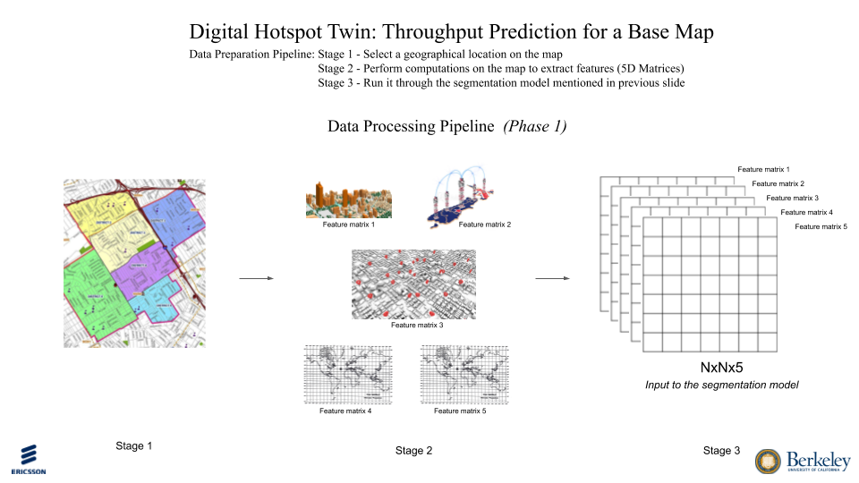

# DigitalTwin

## Introduction
Digital twin refers to a digital replica of potential and actual physical assets, processes, people, places, systems and devices that can be used for various purposes. The digital representation provides both the elements and the dynamics of how an Internet of Things device operates and lives throughout its life cycle. Definitions of digital twin technology used in prior research emphasize two important characteristics. Firstly, each definition emphasizes the connection between the physical model
and the corresponding virtual model or virtual counterpart. Secondly, this connection is established by generating real time data. The concept of the digital twin can be compared to other concepts such as cross-reality environments or co-spaces and mirror models, which aim to, by and large, synchronize part of the physical world (e.g., an object or place) with its cyber representation (which can be an abstraction of some aspects of the physical world).

## Digital Hotspot Twin
Imagine certain hot spots in a city, such a football game where network surge is expected due to large crowds. How can the network be optimized so that the users does not experience any degradation in throughput or increase in latency. Creating a twin with combination of historical data and simulated data where different configurations of network can be tested to find the right configuration for various hot spot scenarios.

## Previous Work
We have a simulator in place which can generate simulated data given any geographical region and initial set of parameters of the network. We can use it as a testbed to train models in the simulator which can then give us the most optimal set of configuration for the entire network that can optimize the network by minimising the latency and maximizing the throughput.


## Problems with the existing Simulation
The current simulator takes a large amount of time to produce the throughput for every user present in a given geographical region. If we want to find the best possible location to place a new base station, we will have to try placing it at multiple potential locations and see the performance (throughput for each user in that area). In order to do that we will have to run the simulator multiple times, once for every new base station location and this will take a lot of time for finding the best location for one base station. 


## Current Work
Our first step is to build an approximation to the current simulator which takes a large amount of time to process and produces throughput values for a user. We are trying to find, can we reduce the amount of time the simulator takes in order generate throughput values for all the users. If we can reduce that time to real-time then trying several potential locations for a new base stations will be faster. 

## Assumptions
1. In order to build a model to approximate the simulator, we need to build a model that takes in a tile/part of a map with information like ```number of users in the location```, ```how many base stations are present```, ``` locations of those base stations``` and ``` Hight of several buildings in the location```.  
2. However, it is still difficult to find a ```uplink throughput```, ```downlink throughput``` value for each user as the number of users keep changing in a geographical region and it is difficult to build a model whose output shape is changing constantly. 
3. Hence, we discretize the entire tile/map before passing into the model. We discretize the entire map into a NxN small grids and thus predict a ```uplink throughput``` and ```downlink throughput``` for each grid square. 
4. We assume that each user in that specific grid will share the same throughput value. Thus, rather than predicting a throughput value for each user, we will instead predict throughput for each square grid. 


## Model 
We use a semantic segmentation approach to build a model that could accurately predict the throughput values for every NxN square grid in the map. More specifically, we use a U-Net Architecture to predict the ```uplink throughput``` and ```downlink throughput``` values for each grid in the map. 

Below is an example of how the model, input data and the output data look like. 




